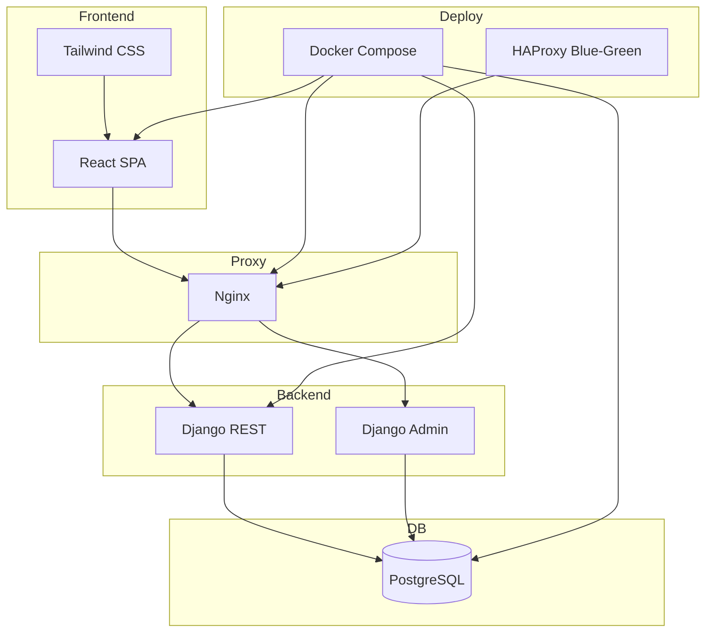

# Documentação Técnica – Sistema de Aluguel de Apartamentos

## Visão Geral
Frontend React (Vite + Tailwind), backend Django REST + Django Admin, banco PostgreSQL, Nginx como proxy/servidor estático. Orquestração com Docker Compose. Estratégia de deploy blue‑green com HAProxy (opcional) e scripts em `scripts/`.

## Diagrama (alto nível)

## Endpoints e contratos
- API raiz: `/api/v1/` (ver `aptos/api_urls.py`)
- Health: `/api/v1/health/`
- Apto(s): `/api/v1/aptos/` (paginação DRF), `/api/v1/aptos/{id}/`
- Builders: `/api/v1/builders/`, `/api/v1/builders/{id}/apartments/`

## Segurança (produção)
- TLS/HTTPS obrigatório (terminação no Nginx/Load Balancer)
- Cabeçalhos de segurança no Nginx (CSP, X-Frame-Options, etc.)
- `ALLOWED_HOSTS`, `SECURE_PROXY_SSL_HEADER` configurados
- Usuário não‑root nos containers de app (produção)

## Perf/Observabilidade
- Gzip/brotli (Nginx), cache agressivo de assets (hash)
- Health checks no LB e Compose
- Prometheus/Grafana (monitoring/) – base inicial

## Deploy
- Compose perfis: `react` (dev), `production` (Nginx), `blue‑green` (arquivo dedicado)
- Scripts: `scripts/deploy.sh` (BG) e `scripts/post-deploy-validation.sh`

---

### Referências rápidas
- Compose principal: `docker-compose.yml`
- Blue‑Green: `docker-compose.blue-green.yml`, `haproxy/haproxy.cfg`
- Frontend: `frontend/` (Vite), API base env: `VITE_API_BASE_URL`
- Backend: `app/` (Django), app `aptos/`
