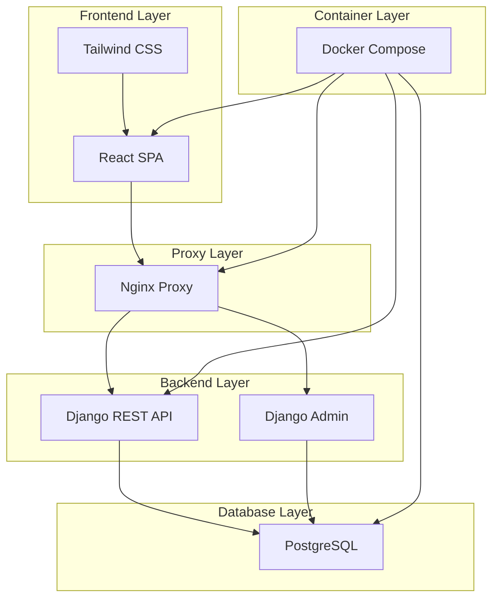

<task_context>
<domain>deployment/documentation</domain>
<type>documentation</type>
<scope>configuration</scope>
<complexity>medium</complexity>
<dependencies>deployment</dependencies>
</task_context>

# Tarefa 12.0: Documentação e Preparação Go-Live

## Visão Geral

Criar documentação completa do sistema, runbooks operacionais, plano de go-live, treinamento para usuários, configuração de monitoramento de produção, e checklist final de pré-produção para garantir transição suave e operação confiável.

<requirements>
- Documentação técnica completa (arquitetura, APIs, deployment)
- Runbooks operacionais para troubleshooting
- Plano de go-live detalhado com timeline
- Guia de usuário para Django Admin
- Configuração de monitoramento em produção
- Checklist de pré-produção validado
- Plano de rollback documentado
- Training materials para equipe de suporte
- Documentação de recuperação de desastres
</requirements>

## Subtarefas

- [ ] 12.1 Criar documentação técnica completa
- [ ] 12.2 Desenvolver runbooks operacionais
- [ ] 12.3 Elaborar plano de go-live detalhado
- [ ] 12.4 Criar guia de usuário Django Admin
- [ ] 12.5 Configurar monitoramento de produção
- [ ] 12.6 Desenvolver checklist de pré-produção
- [ ] 12.7 Criar plano de disaster recovery
- [ ] 12.8 Preparar materiais de treinamento

## Detalhes de Implementação

### Technical Architecture Documentation:

```markdown
# Documentação Técnica - Sistema de Aluguel de Apartamentos

## Visão Geral da Arquitetura

### Componentes Principais



### Tecnologias Utilizadas

| Componente | Tecnologia | Versão | Propósito |
|------------|------------|---------|----------|
| Frontend | React | 18+ | Interface do usuário |
| Styling | Tailwind CSS | 3+ | Design system |
| Backend | Django | 5.2 | API REST e Admin |
| API Framework | Django REST Framework | 3.14+ | Endpoints REST |
| Banco de Dados | PostgreSQL | 15+ | Persistência de dados |
| Proxy | Nginx | 1.24+ | Load balancer e static files |
| Containerização | Docker | 24+ | Deployment e isolamento |
| Orquestração | Docker Compose | 2.21+ | Multi-container management |

### Fluxo de Dados

1. **Requisição do Usuário**
   - Usuário acessa aplicação via browser
   - Nginx serve React SPA (static files)
   - JavaScript carrega e executa no browser

2. **Chamadas de API**
   - React faz requisições HTTP para APIs
   - Nginx proxy pass para Django backend
   - Django processa e consulta PostgreSQL
   - Response JSON retorna para React

3. **Gerenciamento de Conteúdo**
   - Administradores acessam Django Admin
   - Upload de mídia via Django Admin
   - Files salvos em volumes Docker
   - Nginx serve media files

### Segurança

- **HTTPS obrigatório** em produção
- **CSRF protection** em todas APIs
- **CORS** configurado adequadamente
- **Rate limiting** implementado
- **Security headers** via Nginx
- **File upload validation** no Django
- **SQL injection protection** via Django ORM

### Performance

- **CDN** para static files (produção)
- **Gzip compression** habilitado
- **Database indexing** otimizado
- **Query optimization** com select_related/prefetch_related
- **React code splitting** por rotas
- **Image lazy loading** implementado
- **Browser caching** configurado

## API Documentation

### Base URLs

- **Development**: `http://localhost:8000/api/v1/`
- **Production**: `https://yourdomain.com/api/v1/`

### Authentication

```http
# Session-based authentication (Django Admin compatibility)
Cookie: sessionid=<session_id>
X-CSRFToken: <csrf_token>
```

### Endpoints

#### Apartamentos

```http
GET /api/v1/aptos/
```
Lista apartamentos com paginação e filtros.

**Query Parameters:**
- `is_available` (boolean): Filtrar por disponibilidade
- `number_of_bedrooms` (integer): Filtrar por número de quartos
- `number_of_bathrooms` (integer): Filtrar por número de banheiros
- `has_parking` (boolean): Filtrar por estacionamento
- `has_air_conditioning` (boolean): Filtrar por ar condicionado
- `search` (string): Busca em unit_number, description, building_name
- `page` (integer): Número da página (default: 1)

**Response:**
```json
{
  "count": 150,
  "next": "http://localhost:8000/api/v1/aptos/?page=2",
  "previous": null,
  "results": [
    {
      "id": 1,
      "unit_number": "101",
      "floor": "1",
      "building_name": {
        "id": 1,
        "name": "Edifício Exemplo",
        "city": "São Paulo",
        "neighborhood": "Centro"
      },
      "description": "Apartamento mobiliado...",
      "rental_price": "1500.00",
      "is_available": true,
      "number_of_bedrooms": 2,
      "number_of_bathrooms": 1,
      "square_footage": 80,
      "fotos": [
        {
          "id": 1,
          "photos": "/media/aptos/aptos_photos/foto1.jpg"
        }
      ]
    }
  ]
}
```

#### Empreendimentos

```http
GET /api/v1/builders/
```
Lista Empreendimentos com suas fotos.

**Response:**
```json
{
  "count": 50,
  "results": [
    {
      "id": 1,
      "name": "Construtora ABC",
      "street": "Rua Example, 123",
      "neighborhood": "Centro",
      "city": "São Paulo",
      "state": "SP",
      "builder_fotos": [
        {
          "id": 1,
          "photos": "/media/builders/builders_photos/foto1.jpg"
        }
      ]
    }
  ]
}
```

## Deployment Guide

### Prerequisites

- Docker 24+
- Docker Compose 2.21+
- Git
- Nginx (production)
- PostgreSQL (production)
- SSL Certificate (production)

### Development Deployment

```bash
# Clone repository
git clone <repository-url>
cd apartment-rental-system

# Copy environment file
cp .env.example .env

# Edit environment variables
nano .env

# Build and start services
docker-compose up --build

# Run migrations
docker-compose exec backend python manage.py migrate

# Create superuser
docker-compose exec backend python manage.py createsuperuser

# Access application
# Frontend: http://localhost:3000
# Backend API: http://localhost:8000/api/v1/
# Admin: http://localhost:8000/admin/
```

### Production Deployment

```bash
# Production deployment with Blue-Green
./deploy.sh

# Or manual deployment
docker-compose -f docker-compose.prod.yml up -d

# Verify deployment
./post-deploy-validation.sh https://yourdomain.com
```

## Database Schema

### Core Models

```sql
-- Builders (Empreendimentos)
CREATE TABLE aptos_builders (
    id SERIAL PRIMARY KEY,
    name VARCHAR(100) NOT NULL,
    street VARCHAR(100) NOT NULL,
    neighborhood VARCHAR(100) NOT NULL,
    city VARCHAR(100) NOT NULL,
    state VARCHAR(100) NOT NULL,
    zip_code VARCHAR(20) NOT NULL,
    country VARCHAR(100) NOT NULL,
    video VARCHAR(100),
    created_at TIMESTAMPTZ NOT NULL,
    updated_at TIMESTAMPTZ NOT NULL
);

-- Apartments (Apartamentos)
CREATE TABLE aptos_aptos (
    id SERIAL PRIMARY KEY,
    unit_number VARCHAR(10) NOT NULL,
    floor VARCHAR(20),
    building_name_id INTEGER REFERENCES aptos_builders(id),
    description TEXT NOT NULL,
    rental_price DECIMAL(10,2) DEFAULT 0.0,
    is_available BOOLEAN DEFAULT true,
    is_furnished BOOLEAN DEFAULT false,
    is_pets_allowed BOOLEAN DEFAULT false,
    has_laundry BOOLEAN DEFAULT false,
    has_parking BOOLEAN DEFAULT false,
    has_internet BOOLEAN DEFAULT false,
    has_air_conditioning BOOLEAN DEFAULT false,
    number_of_bedrooms INTEGER NOT NULL,
    number_of_bathrooms INTEGER NOT NULL,
    square_footage INTEGER NOT NULL,
    video VARCHAR(100),
    created_at TIMESTAMPTZ NOT NULL,
    updated_at TIMESTAMPTZ NOT NULL
);

-- Photos for Apartments
CREATE TABLE aptos_foto (
    id SERIAL PRIMARY KEY,
    apto_id INTEGER REFERENCES aptos_aptos(id),
    photos VARCHAR(100) NOT NULL
);

-- Photos for Builders
CREATE TABLE aptos_builderfoto (
    id SERIAL PRIMARY KEY,
    builder_id INTEGER REFERENCES aptos_builders(id),
    photos VARCHAR(100) NOT NULL
);
```

### Optimized Indexes

```sql
CREATE INDEX idx_aptos_available ON aptos_aptos(is_available);
CREATE INDEX idx_aptos_bedrooms ON aptos_aptos(number_of_bedrooms);
CREATE INDEX idx_aptos_building ON aptos_aptos(building_name_id);
CREATE INDEX idx_builders_name ON aptos_builders(name);
CREATE INDEX idx_builders_city ON aptos_builders(city);
```

## Troubleshooting Guide

### Common Issues

#### 1. Container Won't Start

**Symptoms:**
- `docker-compose up` fails
- Services exit immediately

**Diagnosis:**
```bash
# Check logs
docker-compose logs <service-name>

# Check container status
docker ps -a

# Check resource usage
docker stats
```

**Solutions:**
- Verify environment variables in `.env`
- Check port conflicts (80, 443, 5432, 8000)
- Ensure sufficient disk space
- Verify Docker daemon is running

#### 2. Database Connection Errors

**Symptoms:**
- "could not connect to server"
- Django migrations fail

**Diagnosis:**
```bash
# Test database connection
docker-compose exec backend python manage.py dbshell

# Check PostgreSQL logs
docker-compose logs db

# Verify environment variables
docker-compose exec backend env | grep DATABASE
```

**Solutions:**
- Verify `DATABASE_URL` format
- Check PostgreSQL container health
- Ensure database user has correct permissions
- Wait for database to be ready before starting backend

#### 3. API Requests Failing

**Symptoms:**
- 500 Internal Server Error
- CORS errors in browser

**Diagnosis:**
```bash
# Check backend logs
docker-compose logs backend

# Test API directly
curl http://localhost:8000/api/v1/aptos/

# Check CORS settings
grep -r CORS_ALLOWED_ORIGINS .
```

**Solutions:**
- Verify `CORS_ALLOWED_ORIGINS` includes frontend URL
- Check Django settings configuration
- Ensure API endpoints are properly registered
- Verify middleware order

#### 4. Frontend Not Loading

**Symptoms:**
- Blank page
- JavaScript errors
- Build fails

**Diagnosis:**
```bash
# Check frontend logs
docker-compose logs frontend

# Check browser console
# Open DevTools → Console

# Verify build
docker-compose exec frontend npm run build
```

**Solutions:**
- Clear browser cache
- Verify React build completed successfully
- Check `PUBLIC_URL` environment variable
- Ensure all dependencies are installed

### Performance Issues

#### Slow API Responses

**Diagnosis:**
```bash
# Check query performance
docker-compose exec backend python manage.py shell
>>> from django.db import connection
>>> print(connection.queries)

# Monitor database performance
docker-compose exec db psql -U aptos_user -d aptos -c "
SELECT query, mean_time, calls 
FROM pg_stat_statements 
ORDER BY mean_time DESC 
LIMIT 10;"
```

**Solutions:**
- Add database indexes for commonly queried fields
- Use `select_related()` and `prefetch_related()`
- Implement query caching
- Optimize N+1 query problems

#### High Memory Usage

**Diagnosis:**
```bash
# Check container memory usage
docker stats

# Check Django memory usage
docker-compose exec backend python -c "
import psutil
print(f'Memory: {psutil.virtual_memory().percent}%')
"
```

**Solutions:**
- Increase Docker memory limits
- Optimize database queries
- Implement pagination for large datasets
- Add memory monitoring alerts
```

### Runbooks Operacionais:

```markdown
# Runbook Operacional - Sistema de Apartamentos

## Rotinas de Monitoramento

### Checklist Diário

- [ ] Verificar status de todos os containers
- [ ] Monitorar uso de CPU/RAM/Disco
- [ ] Verificar logs de erro
- [ ] Testar endpoints críticos
- [ ] Verificar backup do banco de dados
- [ ] Monitorar tempo de resposta das APIs

### Comandos de Monitoramento

```bash
# Status dos serviços
docker-compose ps

# Logs em tempo real
docker-compose logs -f --tail=100

# Uso de recursos
docker stats

# Health checks
curl -f http://localhost/health

# Status do banco
docker-compose exec db pg_isready -U aptos_user -d aptos
```

## Procedimentos de Backup

### Backup Diário Automático

```bash
#!/bin/bash
# backup-daily.sh

BACKUP_DIR="/backups/daily"
DATE=$(date +%Y%m%d_%H%M%S)

# Database backup
docker exec aptos-db pg_dump -U aptos_user aptos | gzip > "${BACKUP_DIR}/db_${DATE}.sql.gz"

# Media files backup
tar -czf "${BACKUP_DIR}/media_${DATE}.tar.gz" ./media/

# Keep only last 7 days
find ${BACKUP_DIR} -name "*.gz" -mtime +7 -delete

echo "Backup completed: ${DATE}"
```

### Backup Manual

```bash
# Backup completo do banco
docker exec aptos-db pg_dump -U aptos_user aptos > backup_$(date +%Y%m%d).sql

# Backup de media files
tar -czf media_backup_$(date +%Y%m%d).tar.gz media/

# Backup de configurações
tar -czf config_backup_$(date +%Y%m%d).tar.gz \
    docker-compose.yml \
    .env \
    nginx/ \
    ssl/
```

## Procedimentos de Restore

### Restore do Banco de Dados

```bash
# Parar aplicação
docker-compose stop backend frontend

# Restore database
cat backup_YYYYMMDD.sql | docker exec -i aptos-db psql -U aptos_user -d aptos

# Restart aplicação  
docker-compose start backend frontend

# Verificar integridade
docker-compose exec backend python manage.py check
```

### Restore de Media Files

```bash
# Backup atual
mv media/ media_backup_$(date +%Y%m%d)/

# Restore backup
tar -xzf media_backup_YYYYMMDD.tar.gz

# Ajustar permissões
sudo chown -R 1000:1000 media/
```

## Procedimentos de Emergência

### Sistema Completamente Indisponível

1. **Verificar infraestrutura básica**
   ```bash
   # Verificar se servidor está respondendo
   ping yourdomain.com
   
   # Verificar portas
   telnet yourdomain.com 443
   ```

2. **Verificar Docker**
   ```bash
   # Status do Docker daemon
   systemctl status docker
   
   # Restart se necessário
   sudo systemctl restart docker
   ```

3. **Restart completo da aplicação**
   ```bash
   # Parar todos os serviços
   docker-compose down
   
   # Limpar containers órfãos
   docker container prune -f
   
   # Restart completo
   docker-compose up -d
   ```

4. **Rollback para versão anterior**
   ```bash
   # Se há problema com nova versão
   ./deploy.sh rollback
   ```

### Alto Uso de CPU/RAM

1. **Identificar container problemático**
   ```bash
   docker stats --no-stream
   ```

2. **Investigar logs**
   ```bash
   docker-compose logs --tail=200 <container-name>
   ```

3. **Restart seletivo**
   ```bash
   docker-compose restart <service-name>
   ```

4. **Escalar horizontalmente** (se suportado)
   ```bash
   docker-compose up -d --scale backend=2
   ```

### Banco de Dados Corrompido

1. **Parar aplicação imediatamente**
   ```bash
   docker-compose stop backend frontend
   ```

2. **Verificar integridade**
   ```bash
   docker-compose exec db postgres -c "REINDEX DATABASE aptos;"
   ```

3. **Restore do último backup**
   ```bash
   # Encontrar último backup válido
   ls -la /backups/daily/ | tail -5
   
   # Restore
   gunzip -c /backups/daily/db_YYYYMMDD_HHMMSS.sql.gz | \
   docker exec -i aptos-db psql -U aptos_user -d aptos
   ```

### SSL Certificate Expiring

1. **Verificar expiração**
   ```bash
   openssl x509 -in ssl/cert.pem -text -noout | grep "Not After"
   ```

2. **Renovar certificado** (Let's Encrypt)
   ```bash
   certbot renew --nginx
   ```

3. **Restart Nginx**
   ```bash
   docker-compose restart nginx
   ```

## Contatos de Emergência

- **DevOps Lead**: +55 11 99999-9999
- **Database Admin**: +55 11 88888-8888  
- **Infrastructure Team**: infrastructure@company.com
- **Hosting Provider Support**: support@hostingprovider.com

## Escalation Matrix

| Issue Severity | Response Time | Contacts |
|----------------|---------------|----------|
| P0 - System Down | 15 minutes | All teams, Management |
| P1 - Critical Feature Down | 1 hour | DevOps, Backend Team |  
| P2 - Performance Issues | 4 hours | Responsible Team |
| P3 - Minor Issues | Next business day | Responsible Team |
```

### Go-Live Plan:

```markdown
# Plano de Go-Live - Sistema de Apartamentos

## Timeline de Go-Live

### T-7 dias: Preparação Final
- [ ] Freeze de código (code freeze)
- [ ] Validação completa em staging
- [ ] Backup completo do sistema atual
- [ ] Comunicação aos stakeholders
- [ ] Preparação da equipe de suporte

### T-3 dias: Validação Pré-Produção
- [ ] Deploy em ambiente idêntico à produção
- [ ] Testes de smoke completos
- [ ] Validação de performance
- [ ] Testes de acessibilidade
- [ ] Aprovação final dos stakeholders

### T-1 dia: Checklist Final
- [ ] Verificação de todos os sistemas
- [ ] Confirmação da equipe de suporte
- [ ] Backup final do sistema atual
- [ ] Preparação dos scripts de rollback
- [ ] Comunicação de manutenção aos usuários

### Dia do Go-Live: Timeline Detalhado

#### 02:00 - Início da Janela de Manutenção
- [ ] **02:00-02:15**: Parar sistema atual
  ```bash
  # Parar aplicação Django atual
  sudo systemctl stop nginx
  sudo systemctl stop gunicorn
  
  # Exibir página de manutenção
  cp maintenance.html /var/www/html/index.html
  sudo systemctl start nginx
  ```

- [ ] **02:15-02:45**: Backup Final e Migração de Dados
  ```bash
  # Backup final SQLite
  cp /path/to/current/db.sqlite3 /backups/final_backup_$(date +%Y%m%d_%H%M%S).sqlite3
  
  # Executar migração para PostgreSQL
  python migrate_sqlite_to_postgresql.py
  
  # Validar migração
  python validate_migration.py
  ```

- [ ] **02:45-03:30**: Deploy Nova Versão
  ```bash
  # Deploy blue-green
  ./deploy.sh
  
  # Validar deploy
  ./post-deploy-validation.sh
  ```

- [ ] **03:30-04:00**: Testes de Validação
  ```bash
  # Testes automáticos
  npm run test:e2e:production
  
  # Testes manuais críticos
  # - Login Django Admin
  # - Upload de foto
  # - Listagem de apartamentos
  # - Filtros de busca
  # - Responsividade mobile
  ```

- [ ] **04:00-04:15**: Go-Live
  ```bash
  # Remover página de manutenção
  # Ativar monitoramento
  # Comunicar go-live para equipe
  ```

#### 04:15-06:00: Monitoramento Intensivo
- [ ] Monitor de performance em tempo real
- [ ] Análise de logs
- [ ] Suporte proativo
- [ ] Comunicação com stakeholders

#### 08:00: Comunicação Final
- [ ] Email para todos os usuários
- [ ] Atualização no site
- [ ] Post-mortem preparado

## Critérios de Sucesso

### Critérios de Go/No-Go (T-4 horas)
- [ ] Todos os testes de validação passando
- [ ] Sistema de rollback testado e funcional
- [ ] Equipe de suporte disponível e treinada
- [ ] Backup verificado e íntegro
- [ ] Ambiente de produção estável

### Critérios Pós Go-Live
- [ ] Sistema respondendo em <3 segundos
- [ ] APIs respondendo em <500ms
- [ ] Zero erros 500 nos primeiros 30 minutos
- [ ] Django Admin funcional
- [ ] Upload de mídia funcionando
- [ ] Responsividade mobile validada

## Plano de Rollback

### Trigger de Rollback
Executar rollback se:
- Error rate >5% nos primeiros 30 minutos
- Tempo de resposta >5 segundos consistentemente
- Django Admin não funcional
- APIs principais com erro >1%
- Impossibilidade de upload de mídia

### Procedimento de Rollback (Tempo estimado: 15 minutos)

```bash
# 1. Executar rollback automático
./deploy.sh rollback

# 2. Restaurar banco de dados anterior (se necessário)
gunzip -c /backups/final_backup_YYYYMMDD_HHMMSS.sqlite3.gz > /path/to/db.sqlite3

# 3. Restart sistema anterior
sudo systemctl start gunicorn
sudo systemctl restart nginx

# 4. Validar sistema anterior
curl -f http://localhost/admin/
curl -f http://localhost/aptos/
```

### Comunicação de Rollback
- Comunicação imediata para stakeholders
- Update na página de status
- Email para usuários (se necessário)
- Post-mortem agendado

## Responsabilidades

| Pessoa/Equipe | Responsabilidade |
|---------------|------------------|
| DevOps Lead | Execução técnica, monitoramento |
| Backend Developer | Suporte APIs, Django Admin |
| Frontend Developer | Suporte interface React |
| DBA | Migração dados, performance banco |
| QA Lead | Validação funcional |
| Product Owner | Decisões go/no-go |
| Support Team | Atendimento usuários |

## Comunicação

### Antes do Go-Live
- **T-7 dias**: Email stakeholders sobre data
- **T-3 dias**: Email usuários sobre manutenção
- **T-1 dia**: Lembrete sobre janela de manutenção

### Durante o Go-Live  
- **War room**: Slack channel #go-live-apartments
- **Updates**: A cada 30 minutos no Slack
- **Escalation**: Phone call para management se rollback

### Após Go-Live
- **4h após**: Status report
- **24h após**: Summary report
- **7 dias após**: Retrospective meeting
```

### Training Materials:

```markdown
# Guia do Usuário - Django Admin

## Acessando o Sistema

1. **URL**: https://yourdomain.com/admin/
2. **Login**: Utilize suas credenciais fornecidas
3. **Recuperação de senha**: Entre em contato com o administrador

## Gerenciando Apartamentos

### Adicionando Novo Apartamento

1. Acesse **Apartamentos** → **Adicionar**
2. Preencha os campos obrigatórios:
   - **Número da unidade**: Ex: "101", "23A"
   - **Construtora**: Selecione da lista
   - **Descrição**: Texto completo sobre o apartamento
   - **Número de quartos**: Valor numérico
   - **Número de banheiros**: Valor numérico  
   - **Área (m²)**: Metragem quadrada

3. Configure as opções:
   - ☑️ **Disponível**: Apartamento está para locação
   - ☑️ **Mobiliado**: Possui móveis
   - ☑️ **Pets permitidos**: Aceita animais
   - ☑️ **Estacionamento**: Possui vaga de garagem
   - ☑️ **Internet**: Internet incluída
   - ☑️ **Ar condicionado**: Possui ar condicionado

4. **Adicionando Fotos**:
   - Role até a seção "Fotos"
   - Clique em "Choose File" para cada foto
   - Máximo 10 fotos por apartamento
   - Formatos aceitos: JPG, PNG, WEBP
   - Tamanho máximo: 5MB por foto

5. **Adicionando Vídeo** (opcional):
   - Clique em "Choose File" no campo Vídeo
   - Formatos aceitos: MP4, MOV, AVI
   - Tamanho máximo: 50MB

6. Clique **"Salvar"** ou **"Salvar e adicionar outro"**

### Editando Apartamento Existente

1. Acesse **Apartamentos** → **Lista**
2. Use a busca para encontrar o apartamento
3. Clique no número da unidade para editar
4. Faça as alterações necessárias
5. Clique **"Salvar"**

### Removendo Apartamento

1. Acesse o apartamento para edição
2. Clique em **"Delete"** (canto inferior esquerdo)
3. **Confirme** a exclusão
4. ⚠️ **Atenção**: Esta ação não pode ser desfeita

## Gerenciando Empreendimentos

### Adicionando Nova Construtora

1. Acesse **Empreendimentos** → **Adicionar**
2. Preencha os dados:
   - **Nome**: Nome da construtora/edifício
   - **Endereço completo**: Rua, bairro, cidade, estado, CEP, país
   
3. **Adicionando Fotos da Construtora**:
   - Seção "Fotos do construtor"
   - Até 10 fotos da fachada/área comum
   - Mesmo processo das fotos de apartamentos

4. **Vídeo da Construtora** (opcional):
   - Tour virtual do edifício
   - Apresentação das áreas comuns

### Buscando Registros

#### Busca por Apartamentos
- **Por número**: Digite o número da unidade
- **Por descrição**: Palavras-chave do texto
- **Por construtora**: Nome do edifício

#### Filtros Disponíveis
- **Disponibilidade**: Disponível/Ocupado
- **Mobiliado**: Sim/Não  
- **Quartos**: 1, 2, 3, 4+
- **Estacionamento**: Sim/Não
- **Data de criação**: Período específico

## Boas Práticas

### Para Fotos
✅ **Faça**:
- Use fotos com boa iluminação
- Mostre diferentes ângulos do cômodo
- Inclua foto da fachada do prédio
- Mantenha ordem lógica (sala, quartos, banheiro, cozinha)

❌ **Evite**:
- Fotos escuras ou desfocadas
- Excesso de fotos similares
- Informações pessoais visíveis
- Fotos muito pesadas (>5MB)

### Para Descrições
✅ **Inclua**:
- Localização e transporte próximo
- Características especiais
- Regras do condomínio importantes
- Valor do condomínio
- Observações sobre documentação

❌ **Evite**:
- Informações desatualizadas
- Textos muito longos
- Informações de contato (use campos apropriados)

### Para Preços
- Sempre mantenha valores atualizados
- Use formato: 1500.00 (sem R$, pontos ou vírgulas extras)
- Indique se inclui condomínio na descrição

## Troubleshooting

### "Erro ao carregar página"
- Verifique sua conexão com internet
- Tente atualizar a página (F5)
- Limpe cache do browser (Ctrl+Shift+R)

### "Upload de arquivo falhou"
- Verifique o tamanho do arquivo (max 5MB fotos, 50MB vídeos)
- Confirme o formato (JPG, PNG, WEBP para fotos)
- Tente um arquivo menor

### "Não consigo encontrar um apartamento"
- Use busca por número da unidade
- Verifique se está na seção correta
- Tente buscar pelo nome da construtora

### "Perdeu as alterações"
- Sempre clique "Salvar" antes de sair da página
- Para textos longos, copie antes de salvar (Ctrl+A, Ctrl+C)
- Use "Salvar e continuar editando" para mudanças parciais

## Contato para Suporte

- **Email**: admin@empresa.com
- **Telefone**: +55 11 9999-9999  
- **Horário**: Segunda a sexta, 9h às 18h
- **Urgência**: WhatsApp +55 11 8888-8888
```

## Critérios de Sucesso

- Documentação técnica completa e atualizada criada
- Runbooks operacionais testados e validados
- Plano de go-live aprovado por stakeholders
- Guia de usuário Django Admin validado com usuários finais
- Monitoramento de produção configurado e funcionando
- Checklist de pré-produção 100% completado
- Plano de rollback testado e documentado
- Equipe de suporte treinada e preparada
- Disaster recovery plan documentado e testado
- Materiais de treinamento aprovados
- Comunicação de go-live enviada aos usuários
- War room preparado para dia do go-live